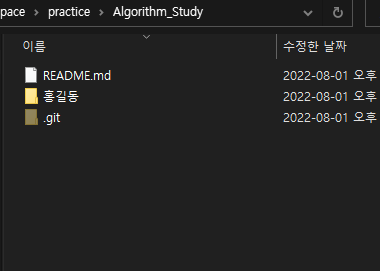

# Steady Study :blue_book:
## 스터디 방향
저희 스터디는 꾸준한 목표 성취와 학습을 추구합니다. 
- 목표를 설정하고 브리핑을 하며 스스로를 평가합니다.
- 온라인 스터디를 통해 자율 학습을 독려합니다.

</br>

## 스터디 룰
- 토요일 - 주, 월 단위 목표 설정 및 성취 여부 평가 (웹엑스)
- 월, 수요일 - 공부 인증(깃허브 커밋)
- 화, 목요일 - 온라인 스터디 (웹엑스)

</br>

## 스터디 참가자
- 이은혁 :star:
- 고영석
- 김지애
- 김지오
- 나혜승
- 이수연

</br>

## 초기 세팅(중요)
1. __스터디 Repository로 들어가 우측 상단의 `Fork` 버튼 클릭__

2. __본인의 Repository에 스터디 Repo가 생성__

3. __본인의 remote 스터디 Repository로 들어가 주소 복사 및 로컬 폴더에 clone 진행__

4. __로컬 Repo 폴더에 본인 이름(한글) 폴더 생성 후, 스터디 인증 파일 넣기__
</br>

</br>

5. __로컬 Repository (본인 이름 폴더 내)에서 Git Bash 실행__</br>

6. __git add, commit 실행__
   
    ```
    $ git add 업로드 파일 이름
    $ git commit -m "커밋내용"
    ```

    __❗ <오류 발생 시 대처법> ❗__</br>
    - 깃허브 remote Repo와 local Repo의 저장된 데이터가 일치하지 않아서 생기는 문제</br>
    일반적으로 remote Repo에 저장된 파일이 local Repo에는 존재하지 않는 경우 발생.
        ```
        ! [rejected]          main -> main (fetch first)
        error: failed to push some refs to 'https://github.com/...
        ```
        따라서, git pull을 통해 로컬 저장소의 파일을 내려받아야 함.</br>
        본인이 업로드할 파일 삭제되지 않게 주의!</br>
        ```
        $ git pull
        ```
    </br>

7. __git push__ </br>
    ```
    $ git push
    ```


8. __Pull Request 진행__</br>
push 완료 후 본인 계정의 github 저장소에 들어오면 Compare & pull reqeust 버튼이 활성화됨.
해당 버튼을 선택하여 메시지를 작성하고 PR을 생성.
</br>

</br>

</br>


[세팅 방법 참고](https://wayhome25.github.io/git/2017/07/08/git-first-pull-request-story/)

</br>

