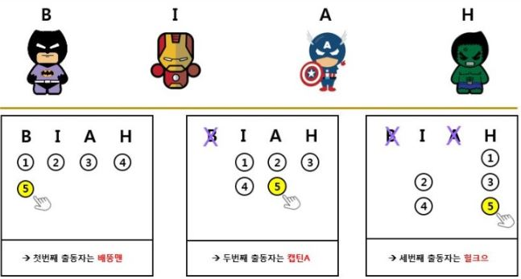

# 민코딩 LV30.5 8번 + Lv 31 8번

## lv.30.5 8번 다시 풀어보는 출동 순서

---

B, I, A, H 슈퍼영웅들 중 출동할 사람을 순서대로 뽑아야 합니다. (아래 그림 참고)
척척박사님은 영웅B를 시작으로 n번째 사람을 선택합니다.

예를 들어보면,
B -> I -> A -> H -> B -> I -> A -> H -> B -> I -> A -> .... 중에서, 항상 n 번째 사람을 출동시키면 됩니다.
만약 5 번째 사람을 출동시킨다고 할 경우,
B-> I- > A-> H-> B 이므로, B를 출동시키면 됩니다.

이제 남은 사람끼리 위와 같은 방법으로, 다섯 번째 사람을 선택하여 출동시키면 됩니다.
(아래 예시 그림 참고)  



(그림 출처: 민코딩)

출동하는 영웅들의 순서를 출력 하세요.

(큐를 이용하지 않고, For문 or While문을 활용해서 풀어주세요)

만약 5를 입력받았다면,

항상 다섯번째 사람을 먼저 출동시키면 됩니다.

---

##### 먼저 풀기 전에 교수님께서 4번까지 돌고 5번 째에 다시 첫번째로 돌아가야 한다는 힌트를 주셨고, 이를 바탕으로 다음과 같이 코드를 작성하였다.

```python
n = int(input())
heros = ["B","I","A","H"]
member = len(heros)

while heros:
    index = n% member - 1      # 5 % 멤버 수 -1
    print(heros.pop(index),end=' ')
    member -= 1                # 멤버 수 -1 (ex. 4 -> 3 -> 2 -> 1)
```

 하지만 이렇게 짜서 돌려보니  B A I H 로 정답인 B A H I와 한 끗차이로 틀렸다. 이를 해결하기 위해 머리를 감싸매고 밤까지 고민했지만, 결국에는 해결책이 나오지 않았고 바로 자러 갔다.

 다음날에 다시 이 문제를 풀기 위해 똑같은 코드를 보던 중 재미있는 규칙을 발견했다.

```python
5 % 4 - 1 = 0         # n % 멤버수 - 1 / [B,I,A,H] 중 0번 B 출력
5 % 3 - 1 = 1         # [I, A, H] 중 1번 A 출력 / 여기까지는 순서대로 됨     
5 % 2 - 1 = 0         # [I, H] 중 0번 I 출력
5 % 1 - 1 = -1        # [H] -1 이지만 요소가 H 하나라서 H 출력
```

바로 이전의 인덱스를 더해주면 원하는 정답이 나온다는 사실이다.

```python
5 % 4 - 1 = 0         # [B,I,A,H] 중 0번 B 출력          
5 % 3 - 1 = 1 + 0     #(이전 인덱스) [I, A, H] 중 1번 A 출력
5 % 2 - 1 = 0 + 1     # [I, H] 중 1번 H 출력
5 % 1 - 1 = -1 + 0    # [I] 마지막 I 출력
```

따라서 다음과 같이 ex_idx(이전 인덱스)를 추가하여 코드를 짰더니 바로 됐다.

```python
n = int(input())
heros = ["B","I","A","H"]
member = len(heros)

ex_idx = 0
while heros:
    index = n% member - 1
    print(heros.pop(index+ex_idx),end=' ') # B A H I 
    member -= 1
    ex_idx = index
er -= 1
```

---

## lv31. 8번숫자 부침개

숫자 2개(P, N)을 입력 받습니다.

P는 숫자 반죽입니다. 숫자 반죽을 불에 구울수록 2배로 커지고,

다 익으면 뒤집는 동작을 반복하여 부침개를 완성하곤 합니다.

1. 숫자에 2를 곱합니다. ex) 123 --> 246

2. 숫자를 뒤집습니다. ex) 246 --> 642

위와 같은 행동을 N번 반복한 후, 만들어지는 숫자를 출력 해 주세요.

만약 123 4를 입력받았다면,

1회 : 123 x 2 = 246 --> 642

2회 : 642 x 2 = 1284 --> 4821

3회 : 4821 x 2 = 9642 --> 2469

4회 : 2469 x 2 = 4938 --> 8394

정답은 8394 입니다.

3926 x 2 = 7852 --> 2587

2587 x 2 = 5174 --> 4715

4715 x 2 = 9430 --> 349

349 x 2 = 698 --> 896


#### 사실 이 문제도 조금 고민을 했다. 숫자로 어떻게 뒤집을 수 있을까 고민하다가 나머지 연산자(%)를 쓰자고 생각했지만, 곧바로 포기했다.

#### 몇 자리가 주어질지도 모를 뿐더러, 일일이 10의 자리 100의 자리 1000의 자리를 %를 사용해야 했기 때문이다.

#### 따라서 빠르게 구글링을 해보았더니 허무할 정도로 간단한 방법이 있었다. 너무 허무할 정도였던게 이미  파이썬 문법 '문자열' 시간에 배운 방법이었다.

#### 바로 '[::-1] ' 이다. 결국에는 1234 라는 숫자를 int(str(1234)[::-1]) 를 하면 결과적으로 4321이 출력된다.

#### 이는 숫자인 1234 -> 문자열 1234 -> 역순으로 4321 -> 다시 숫자 4321로 간단히 해결 됐다.

```python
p = int(input())
n = int(input())

for i in range(n):
    p *= 2
    p= int(str(p)[::-1])
print(p)
```

위와 같은 코드로 해결하였다.
