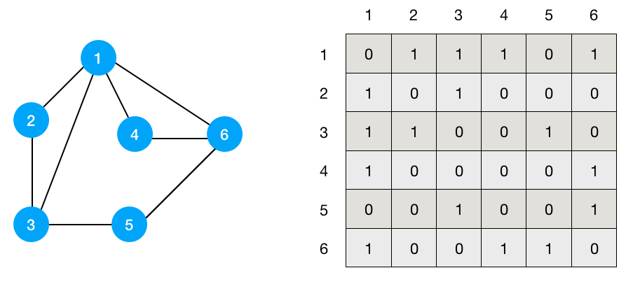
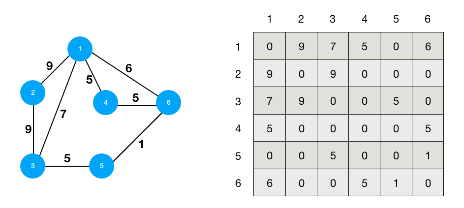
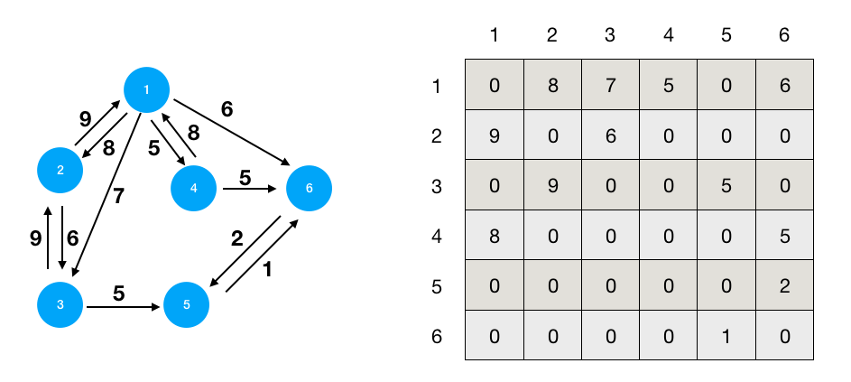
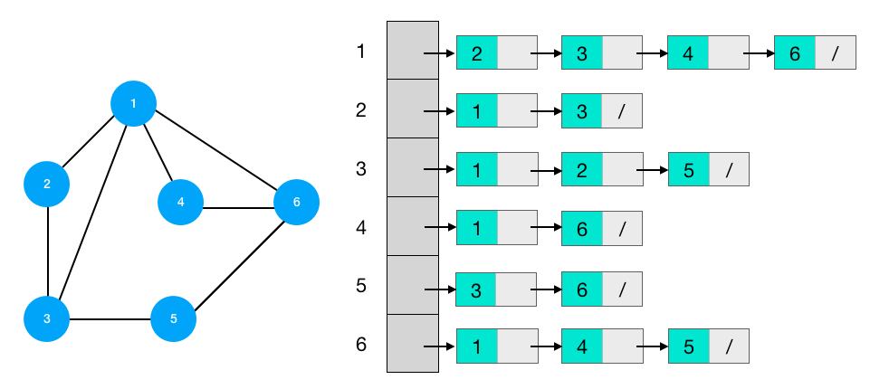
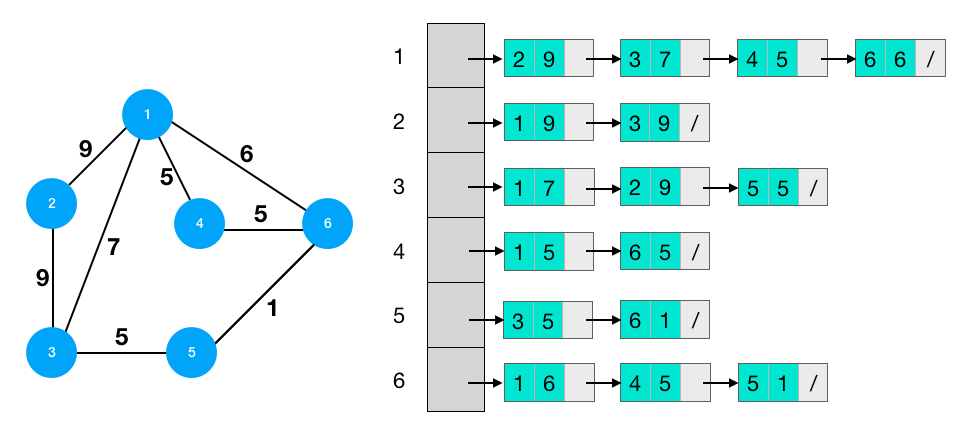
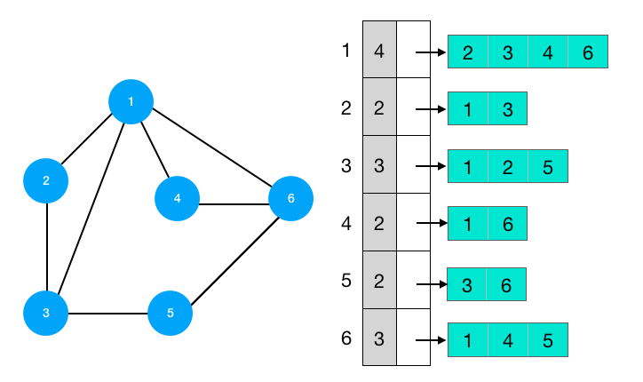

# Algorithm

[문제 풀이](https://www.notion.so/50cdaf21b7a449fdbc1728cafba9341d)

## 알고리즘

- 문제를 해결하기 위한 절차나 방법
- 알고리즘을 표현하는 방법은 크게 두 가지
    - 의사코드(Pseudocode)
    - 순서도
    - **알고리즘 푸는 순서**
        1. 문제읽기
            - 문제 꼼꼼히 읽기(2~3번 정독하고 조건 제대로 파악하기)
            - 시간복잡도 고려(범위 체크) -> 어떤 알고리즘이 효율적일지 생각해볼 것
        2. 설계
            - 아이디어 설계
            - 가독성을 위해 함수 적극 활용
            - 히든 테스트케이스 고려, 직접 케이스 만들어보기
        3. 구현
            - 주석을 통해 틀(구조) 미리 짤 것
            - 가독성 있는 코드 개발(클린코드)
        4. 디버깅
            - 테스트 주도 개발(브레이크 포인트 잡고, 포인트마다 원하는 출력값인지 체크)
            - 디버깅 툴 익숙해질 것

### 좋은 알고리즘의 조건

- 정확성 : 얼마나 정확하게 동작하는가
- 작업량 : 얼마나 적은 연산으로 원하는 결과를 얻어내는가
- 메모리 사용량 : 얼마나 적은 메모리를 사용하는가
- 단순성 : 얼마나 단순한가 *(≠ 짧은 코드)*
- 최적성 : 더 이상 개선할 여직없이 최적화되어있는가

### 알고리즘의 성능 측정

- 시간복잡도(Time Complexity)
    - 실제 걸리는 시간을 측정하는 것은 아님
    - 알고리즘의 작업량을 표현할 때 시간복잡도로 표현
    - 실행되는 명령문의 개수를 계산
- 빅오 표기법(Big-Oh Notation)
    - 시간 복잡도 함수 중에서 가장 큰 영향을 주는 ‘최고차항 n의 항’만을 표시
    - 계수(Coefficient)는 생략

### 배열

- 일정한 자료형의 변수들을 하나의 이름으로 열거하여 사용하는 자료구조
- 아래의 예는 6개의 변수를 사용해야 하는 경우, 이를 배열로 바꾸어 사용하는 것.
    
    ```python
    # num0, num1, num2 = 1, 2, 3
    num = [1, 2, 3]
    ```
    
- 단순히 다수의 변수 선언을 의미하는 것이 아닌, 다수의 변수로는 하기 힘든 작업을 배열을 활용하여 수비게 할 수 있음.

### 1차원 배열

- 1차원 배열의 선언
    
    ```python
    arr = list() # 배열 선언
    arr = [] 
    arr = [1, 2, 3]
    arr = [0] * n # 값이 0인 n개의 원소의 배열
    ```
    

- 1차원 배열의 접근
    
    ```python
    arr[0] = 10
    arr[idx] = 20 # 단 arr[idx]가 존재해야 함. 
    ```
    
- 가장 큰 수를 찾는 법
    
    ```python
    n = int(input())
    arr = list(map(int, input().split()))
    max_value = arr[0] # 첫 원소를 최댓값으로 가정
    									 # 값을 0으로 가정하는 경우 문제 조건에 따라 다른 값이 나올 수도 있음
    for i in range(1, n):
    		if arr[i] > max_value:
    				max_value = arr[i]
    print(max_value)
    
    # float('-inf')또는 float('inf')는 속도가 느리므로 비추천
    ```
    

- 각 원소에 대해 오른쪽에 있는 원소 중 더 작은 원소의 개수 구하기
    
    ```python
    n = int(input())
    arr = list(map(int, input().split()))
    result = []
    for i in range(n):
    		if 
    ```
    

### 정렬

- 2개 이상의 자료를 특정 기준에 의해 작은 값부터 큰 값(오름차순 : Ascending) 혹은 그 반대의 순서(내림차순 : Descending)대로 재배열하는 것
- 키 : 자료를 정렬하는 기준이 되는 특정 값

### 대표적인 정렬방식의 종류

- **버블 정렬(Bubble Sort)**
    - 인접한 두 개의 원소를 비교하며 자리를 계속 교환하는 방식
    - 정렬 과정
        - 첫 번째 원소부터 인접한 원소끼리 계속 자리를 교환하면서 맨 마지막 자리까지 이동
        - 한 단계가 끝나면 가장 큰 원소가 마지막 자리로 정렬
        - 교환하며 자리를 이동하는 모습이 마치 물 위에 올라오는 거품 모양과 비슷하다고 하여 버블정렬이라 함
    - 시간 복잡도 : O(n^2)
    - **ex) [5, 9, 2, 3, 6] 을 버블정렬하는 과정**
        - **1 번째 패스**(구간 [0:4]) : [5, 9, 2, 3, 6]→[5, 2, 9, 3, 6]→[5, 2, 3, 9, 6]→[5, 2, 3, 6, **9**]
        - **2 번째 패스**(구간 [0:3]) : [2, 5, 3, 6, **9**]→[2, 3, 5, 6, **9**]→[2, 3, 5, **6,** **9**]
        - **3 번째 패스**(구간 [0:2]) : [2, 3, 5, **6,** **9**]→[2, 3, **5,** **6,** **9**]
        - **4 번째 패스**(구간 [0:1]) : [2, **3, 5,** **6,** **9**]
        - **정렬 끝**    : **[2, 3, 5, 6, 9]**
        
        ```python
        n = int(input())
        arr = list(map(int, input().split()))
        # arr: 정렬할 리스트, n: 원소의 개수
        
        def BubbleSort(arr, n): 
        		for i in range(n-1, 0, -1):
        				for j in range(0, i):
        						if arr[j] > arr[j+1]:
        								arr[j], arr[j+1] = arr[j+1], arr[j]
        		return arr
        print(BubbleSort(arr, n))
        ```
        

- **카운팅 정렬(Counting Sort)**
    - 항목들의 순서를 결정하기 위해 집합에 각 항목이 몇 개씩 있는지 세는 작업을 하여, 선형 시간에 정렬하는 효율적인 알고리즘
    - 단, 정수나 정수로 표현할 수 있는 자료에 대해서만 적용 가능
    (각 항목의 발생 횟수 기록을 위해, 정수 항목으로 인덱스되는 카운트들의 배열을 사용하기 때문)
    - 카운트들을 위한 충분한 공간을 할당하려면 집합 내의 가장 큰 정수를 알아야 함
    - 시간 복잡도 : O(n)
    - **ex) [0, 4, 1, 3, 1, 2, 4, 1] 을 카운팅 정렬하는 과정**
        - **1단계 - 카운트 배열을 하나 생성하고 각 항목들을 순회하면서 카운트를 늘려준다**
            
            가장 큰 수가 4이므로, 0~4까지의 숫자 카운트를 저장할 배열 생성 
            counts   :    [0, 0, 0, 0, 0]
            
            arr[0] : 0 → [1, 0, 0, 0, 0]
            
            arr[1] : 4 → [1, 0, 0, 0, 1]
            
                             …
            
            arr[7] : 1 → [1, 3, 1, 1, 2]
            
        
        - **2단계 - 카운트 배열의 원소를 조정(누적합을 계산)**
            
            counts    :    [1, 1+3, 1+3+1, 1+3+1+1, 1+3+1+1+2]
            
                            = [1, 4, 5, 6, 8]
            
        - **3단계 - 정렬된 배열을 받을 Temp 배열 생성 후 counts를 -1방향으로 순회**
            
            arr[-1] == 1 → 숫자 1의 누적합은 4 = 4번째 순서
            
            Temp = [null, null, null, 1, null, null, null, null],    counts=[1, 3, 5, 6, 8]
            
            arr[-2] == 4 → 숫자 4의 누적합은 8 = 8번째 순서
            
            Temp = [null, null, null, 1, null, null, null, 4],    counts=[1, 3, 5, 6, 7]
            
            arr[-3] == 2 → 숫자 2의 누적합은 5 = 5번째 순서
            
            Temp = [null, null, null, 1, 2, null, null, 4],    counts=[1, 3, 4, 6, 7]
            
            arr[-4] == 1 → 숫자 1의 누적합은 3 = 3번째 순서
            
            Temp = [null, null, 1, 1, 2, null, null, 4],    counts=[1, 2, 4, 6, 7]
            
            arr[-5] == 3 → 숫자 3의 누적합은 6 = 6번째 순서
            
            Temp = [null, null, 1, 1, 2, 3, null, 4],    counts=[1, 2, 4, 5, 7]
            
            arr[-6] == 1 → 숫자 1의 누적합은 2 = 2번째 순서
            
            Temp = [null, 1, 1, 1, 2, 3, null, 4],    counts=[1, 1, 4, 5, 7]
            
            arr[-7] == 4 → 숫자 4의 누적합은 7 = 7번째 순서
            
            Temp = [null, 1, 1, 1, 2, 3, 4, 4],    counts=[1, 1, 4, 5, 6]
            
            arr[-8] == 0 → 숫자 0의 누적합은 1 = 1번째 순서
            
            Temp = **[0, 1, 1, 1, 2, 3, 4, 4]**,    counts=[0, 1, 4, 5, 6]
            
            **arr = Temp**
            
            ```python
            def CountingSort(arr, k) # k : 배열에서 가장 큰 수
            		# arr : 입력 배열(1 to k)
            		# c : 카운트 배열
            		c = [0]*(k+1)
            		n = len(arr)
            		
            		for i in range(0, n): # 숫자 갯수를 카운트하여 c에 대입
            				c[arr[i]] += 1
            		for j in range(1, k+1): # c[j-1]까지의 누적합을 c[j]에 대입
            				c[j] += c[j-1]
            		tmp = [0] * n
            		for i in range(n-1, -1, -1):
            				c[arr[i]] -= 1
            				tmp[c[arr[i]]] = arr[i]
            		return tmp
            ```
            

- **선택 정렬(Selection Sort)**
    - 시간 복잡도 : O(n^2)
    - **ex) [4,7,1,3,5,2] 을 선택 정렬 하는 과정**
        - 1단계 -
        
        ```python
        arr = [4,7,1,3,5,2]
        for i in range(len(arr)-1):
            for j in range(i+1, len(arr)):
                if arr[i]>arr[j]:
        						# tmp = arr[i]
                    # arr[i]=arr[j]
                    # arr[j]=tmp
                    arr[i], arr[j] = arr[j], arr[i] # 파이썬 스타일
        print(arr)
        ```
        

- **퀵 정렬(Quick Sort)**

- **삽입 정렬(Insertion Sort)**
    - 이미 정렬된 리스트에 새로운 값을 넣고 정렬하는 경우 O(n) 시간복잡도를 가짐
    - 시간 복잡도 : O(n^2)
    - ex) [4,7,1,3,5,2] 을 삽입 정렬하는 과정
        
        ```python
        arr = [4,7,1,3,5,2]
        result = []
        for i in range(len(arr)):
            result.append(arr[i])
            for j in range(i, 0, -1):
                if result[j]<result[j-1]:
                    result[j], result[j-1] = result[j-1], result[j]
        print(result)
        ```
        

- **병합 정렬(Merge Sort)**

| 알고리즘 | 평균 수행시간 | 최악 수행시간 | 알고리즘 기법 | 비고 |
| --- | --- | --- | --- | --- |
| 버블 정렬 | O(n^2) | O(n^2) | 비교 교환 | 쉽게 구현 |
| 카운팅 정렬 | O(n+k) | O(n+k) | 비교환  | n이 비교적 작을 때만 가능 |
| 선택 정렬 | O(n^2) | O(n^2) | 비교 교환 | 교환의 횟수가 버블, 삽입정렬보다 작음 |
| 퀵 정렬 | O(n log n) | O(n^2) | 분할 정복 | 최악의 경우 O(n^2)이지만, 평균적으로 가장 빠름 |
| 삽입 정렬 | O(n^2) | O(n^2) | 비교 교환 | n의 개수가 작을 때 효과적 |
| 병합 정렬 | O(n log n) | O(n log n) | 분할 정복 | 연결리스트의 경우 가장 효율적인 방식 |

### **완전 검색(Exaustive Search)**

- 완전 검색 방법은 문제의 해법으로 생각할 수 있는 모든 경우의 수를 나열해보고 확인하는 기법
- Brute-force 혹은 generate-and-test기법이라고도 불림
- 모든 경우의 수를 테스트한 후, 최종 해법을 도출
- 일반적으로 경우의 수가 상대적으로 작을 때 유용 = 수행속도 느림

### 순열(Permutation) 생성

- 서로 다른 것들 중 몇 개를 뽑아서 한 줄로 나열하는 것
- 서로 다른 **n**개 중 **r**개를 택하는 순열은 아래와 같이 표현

$$
nPr
$$

- 그리고 **nPr**은 다음과 같은 식이 성립

$$
nPr = n*(n-1)*(n-1)*…*2*1
$$

- **nPn = n!**이라고 표기하며, **Factorial**이라고 부름

$$
n! = n*(n-1)*(n-1)*…*2*1
$$

- {1, 2, 3}을 포함하는 모든 순열을 생성하는 함수
    
    ```python
    for i1 in range(1, 4):
    		for i2 in range(1, 4):
    				 if i2 != i1:
    							for i3 in range(1, 4):
    									if i3 != i1 and i3 != i2:
    											print(i1, i2, i3)
    ```
    

### 탐욕(Greedy) 알고리즘

- 최적해를 구하는 데 사용되는 근시안적인 방법
- 여러 경우 중 하나를 결정해야 할 때마다 그 순간에 최적이라고 생각되는 것을 선택해나가는 방식으로 진행하여 최종적인 해답에 도달
- 각 선택 시점에서 이루어지는 결정은 지역적으로는 최적이지만, 그 선택들을 계속 수집하여 최종적인 해답을 만들었다고 하여, 그것이 최적이라는 보장은 없음
- 일반적으로, 머릿속에 떠오르는 생각을 검증 없이 바로 구현하면 Greedy 접근이 됨.
    1. **해 선택** : 현재 상태에서 부분 문제의 최적 해를 구한 뒤 이를 부분해 집합(Solution set)에 추가
    2. **실행 가능성 검사** : 새로운 부분해 집합이 실행 가능한지를 확인. 곧, 문제의 제약 조건을 위반하지 않는지 검사
    3. **해 검사** : 새로운 부분해 집합이 문제의 해가 되는지 확인. 아직 전체 문제의 해가 완성되지 않았다면, 1번부터 다시 시작
    - **ex) 동전 교환 문제**
        
        ```python
        money = [10000, 5000, 1000, 500,100,50,10]
        change=int(input())
        for m in money:
            m_cnt = change//m
            change-=(m_cnt*m)
            if m_cnt>0:
                print(f'{m}원 : {m_cnt}개')
        ```
        

### 자리수를 추출하여 개수를 카우트하는 법

### DAT(Direct Addressing Table)

- 빠른 검색을 위한 자료구조
- 리스트 원소의 범위가 정해지지 않았거나 범위가 클 경우 공간 복잡도가 증가 (메모리 비효율적)
- 시간 복잡도 : O(n)
    
    ```python
    # 1. 기존 방식(2중 for문)
     a = [4,7,1,3,4,1,2,4]
     b = list(map(int, input().split()))
     for i in b:
         cnt = 0
         for j in a:
             if i == j:
                 cnt+=1
         print(f'{i} : {cnt}개 존재')
    
    # 2. 개선된 방식(Direct Addressing Table)
    a = [4,7,1,3,4,1,2,4]
    b = list(map(int, input().split()))
    bucket = [0]*10 # 0~9
    for i in range(len(a)): # a의 원소를 카운트해서 bucket에 입력
        bucket[a[i]]+=1
    		# bucket을 돌며 리스트 b의 원소가 리스트 a에 몇개 존재하는지 출력
    for k in b: 
        print(f'{k} : {bucket[k]}개 존재')
    
    # 3. 응용 - 입력받은 각 숫자의 갯수 출력
    arr=list(map(int, input().split()))
    bucket= [0]*101 # 입력된 각 숫자별 갯수를 담을 bucket 리스트 초기화
    for i in range(len(arr)):
        bucket[arr[i]]+=1
    for i in range(len(bucket)):
        if bucket[i]>0:
            print(f'{i} : {bucket[i]}번 입력')
    ```
    

### 패턴 찾기

```python
arr = [3,6,5,8,5,3,5,8,5,3,3,1,1,3]
pattern = [3,5,8,4]
flag=0

def isPattern(index):
    for i in range(4):
        if arr[index+i]!=pattern[i]:
            return False
    return True

for i in range(len(arr)-3):
    if isPattern(i):
        flag=1

if flag:
    print('패턴 찾음')
else:
    print('패턴 못찾음')
```

### 패턴 찾기 심화

```python
board = [
    ["A", "B", "G", "K"],
    ["T", "T", "A", "B"],
    ["A", "C", "T", "T"]
]

def isPattern(y, x):
    for i in range(2):
        for j in range(len(ptn[0])):
            if board[y+i][x+j]!=ptn[i][j]:
                return False
    return True

ptn = [list(input().split()) for _ in range(2)]
flag = 0
cnt=0
for i in range(2):
    for j in range(4):
        if isPattern(i, j):
            cnt+=1
print(cnt)
```

## 2차원 배열

- 1차원 리스트를 묶어놓은 리스트
- 2차원 이상의 다차원 리스트는 차원에 따라 index 선언
- 2차원 리스트 선언 : 세로길이(행의 갯수), 가로길이(열의 길이)를 필요로 함
- 파이썬에서는 데이터 초기화를 통해 변수선언과 초기화가 가능

```python
arr = [[0,1,2,3],[4,5,6,7]]
'''
0 1 2 3
4 5 6 7
'''
```

- 파이썬은 리스트 컴프리핸션을 이용해 간단하게 2차원 배열 선언 가능

```python
n = int(input())
arr = [list(map(int,input().split())) for _ in range(n)]
```

### 배열 순회

- **행 순회(→)**
    
    ```python
    for i in range(n):
    		for j in range(m):
    				array[i][j] # 필요한 연산 수행
    ```
    
- **열 순회(↓)**
    
    ```python
    for i in range(n):
    		for j in range(m):
    				array[j][i] # 필요한 연산 수행
    ```
    

- **지그재그 순회(← → ← →)**
    
    ```python
    for i in range(n):
    		for j in range(m):
    				array[i][j + (m-1-2*j)*(i%2)]
    ```
    

- **다이렉트(Direct/ Delta search)를 이용한 2차원 배열 탐색(← ↑ → ↓)**
    - 2차원 배열의 한 좌표에서 4방향의 인접 배열 요소를 탐색하는 방법
    
    ```python
    x, y = map(int, input().split())
    dx = [0, 1, 0, -1]
    dy = [1, 0, -1, 0]
    
    arr = [[1,2,3],[4,5,6],[7,8,9]]
    for k in range(4):
    		ny = y + dy[k]
    		nx = x + dx[k]
    		if 0 <= ny < N and 0 <= nx < M:
    				print(arr[ny][nx])
    ```
    
    - [응용] 상하좌우, 자기 자신을 합하기
    
    ```python
    arr=[[3,5,4],[1,1,2],[1,3,9]]
    d = [[-1,0],[1,0],[0,-1],[0,1]]
    
    max_x = max_y = 0
    max_rs = 0
    max_rs = float('-inf')
    
    def getSum(y, x):  # 가독성을 위해 델타는 함수로 만들어 따로 빼는 것을 권장
        row_sum = arr[i][j]
        for k in range(4):
            dx = j + d[k][1]
            dy = i + d[k][0]
            if dy > 2 or dx > 2 or dx < 0 or dy < 0: continue
            row_sum += arr[dy][dx]
        return row_sum
    
    for i in range(3):
        for j in range(3):
            row_sum = getSum(j, i)
            if row_sum > max_rs:
                max_y, max_x = i, j
                max_rs = row_sum
    print(max_rs)
    print(max_x, max_y)
    ```
    

## 비트 연산자

`&` : 비트 단위로 AND 연산

`|` : 비트 단위로 OR 연산

`<<` : 피연산자의 비트 열을 왼쪽으로 이동

`>>` : 피연산자의 비트 열을 오른쪽으로 이동

- `<<` 연산자
    - 1<<n : 2^n 즉, 원소가 n개일 경우의 모든 부분집합의 수를 의미
- `&` 연산자
    - i&(1<<j) : i의 j번째 비트가 1인지 아닌지를 검사

### 부분집합 합(Subset Sum) 구하기

- 집합의 모든 부분집합 생성
- 집합의 원소가 n개일 때, 부분집합의 수는

$$
부분집합개수= 2^n개
$$

```python
arr = [2,5,6,1,5,3]
n = len(arr)                         # n : 원소의 개수
for i in range(1<<n):                # 1<<n : 부분집합의 개수
		for j in range(n):               # 원소의 수만큼 비트를 비교
				if i & (i<<j):               # i번의 j번 비트가 1인 경우
						print(arr[j], end=", ")  # j번 원소 출력
		print()
print()
```

## 검색(Search)

- 저장되어 있는 자료 중 원하는 항목을 찾는 작업
    - 탐색 키(Search Key) : 자료를 구별하여 인식할 수 있는 키
    - 

### 검색의 종류

- **순차 검색(sequential search)**
    - 일렬로 되어있는 자료를 순서대로 검색하는 방법
    - 배열이나 연결리스트 등 순차구조로 구현된 자료구조에서 원하는 항목을 찾을 때 유용
    - 알고리즘이 단순하여 구현이 쉽지만, 검색 대상의 수가 많은 경우 수행시간이 급격히 증가하여 비효율적임.
    - **정렬되어 있지 않은 경우**
        - 검색과정
            1. 첫번째 원소부터 순서대로 검색 대상과 키 값이 같은 원소가 있는지 비교하며 검색
            2. 키값이 동일한 원소를 찾으면 그 원소의 인덱스를 반환
            3. 자료구조의 마지막에 이를 때까지 검색 대상을 찾지 못하면 검색 실패
        - 시간 복잡도 : O(n)  
        (단, 원소의 순서에 따라 비교 회수 편차가 큼)
        
        ```python
        def sequentialSearch(a, n, key):
        		i = 0
        		whiele i < n and a[i]!=key:
        				i+=1
        		if i<n:
        				return i
        		else:
        				return -1
        ```
        
    
    - 정렬되어 있는 경우
        - 검색과정
            1. 정렬되어 있으므로, 검색 실패를 반환하는 경우 평균 비교 회수가 반으로 줄어듦
        - 시간 복잡도 : O(n)
        
        ```python
        def sequentialSearch(a, n, key):
        		i = 0
        		while i<n and a[i]<key:
        				i+=1
        		
        ```
        

- **이진 검색(binary search)**
    - 
- **(parametric search)**
- **해쉬(hash)**

### 인덱스

## 슬라이딩 윈도우(Sliding Window)

```python
n, m = map(int, input().split())
arr = [4,7,1,8,9,3,5,8,6,6,9]

total = 0
for i in range(m):   # 0~m-1번째까지의 합 구하기
    total += arr[i]
max_val = total
for i in range(n-m):   # 첫번째 인덱스를 빼고 i+m번째 인덱스를 추가
    total= total-arr[i]+arr[i+m]
    if total>max_val:   # max_val값을 갱신
        max_val=total
print(max_val)
```

## 투포인터

```python
target = int(input())
arr = [1,2,3,2,5,5]
n=len(arr)
cnt = sum = 0
high = low = 0 # high, low는 인덱스
while high <= n and low <= n:
    if sum==target:
        cnt+=1
    elif sum > target:
        sum -= arr[low]
        low+=1
    else:
        sum+=arr[high]
        cnt+=1
        high+=1
print(cnt)
```

### 대각선 합 구하기

](./img/111.png)

[https://coding-gongboo.tistory.com/29](https://coding-gongboo.tistory.com/29)

- **풀이**
    
    ```python
    arr = [[1,2,3,4],[5,6,7,8],[9,10,11,12],[13,14,15,16]]
    res=[0]*(2*len(arr)-1)
    for i in range(4):
        for j in range(4):
            res[i+j]+=arr[i][j]
    print(res)
    ```
    

---

### 자료 구조

 : 데이터를 저장하거나 관리하는 방식

- 큐 (FIFO, First-In-First-Out : 선입선출)
- 스택 (LIFO, Last-In-First-Out : 후입선출)

### 선형 자료구조

- 리스트 ⇒ 값 삽입 또는 삭제 시 이후의 인덱스 값을 모두 바꿔야 하기 때문에 느림
- 링크드 리스트 ⇒ 값의 추가 삭제가 용이
    
    

### 비선형 자료구조

- 그래프 : 현상이나 사물을 정점(Vertex)과 간선(Edge)으로 표현하는 것으로, data들의 관계를 나타내고 표현할 때 사용
    - 정점 : 대상이나 개체를 나타냄
    - 간선 : 대상이나 개체간의 관계를 나타냄
- 그래프의 종류
    - 유향 그래프(Directed Graph) : 간선의 방향이 있는 그래프
        - 트리 구조 : 단방향, 부모 자식 관계. 사이클이 발생하지 않음
        (최상단 노드 : 루트 노드, 최하단 노드 : 리프 노드)
            
            ```python
            # 인접 행렬
            arr = [
            [0,1,1,0,0,0],
            [0,0,0,1,1,0],
            [0,0,0,0,0,1],
            [0,0,0,0,0,0],
            [0,0,0,0,0,0],
            [0,0,0,0,0,0]
            ]
            
            # 인접 리스트
            brr = [
            [1,2], # 0번 노드의 인접 리스트
            [3,4], # 1번 노드의 인접 리스트
            [5],   # 2번 노드의 인접 리스트
            [],    # 3번 노드의 인접 리스트
            [],    # 4번 노드의 인접 리스트
            []     # 5번 노드의 인접 리스트
            ]
            
            # 이진트리를 1차원 배열에 담는 법
            # 루트노드를 1번 인덱스로,
            # 자식노드는 직계부모 노드 인덱스의 x2(왼쪽), x2+1(오른쪽)에 저장,
            crr = ['_','A','B','C','D','E','F']
            ```
            
            ```python
            name = ['A','B','C','D','E']
            arr = [
                [0,1,1,0,0],# A가 연결한 노드 인덱스
                [0,0,0,0,1],# B가 연결한 노드 인덱스
                [0,1,0,0,0],
                [0,1,0,0,0],
                [0,0,0,1,0],
            ]
            res = [0]*5
            max_idx = 0
            for i in range(5):
                for j in range(5):
                    res[i] += arr[j][i]
                    if res[i]>res[max_idx]:
                        max_idx = i
            print(name[max_idx])
            ```
            
        
        - 트리가 아닌 구조 : 양방향 가능, 경우에 따라 사이클 발생할 수도 있음.
    - 무향 그래프(Undirected Graph) : 간선의 방향이 없는 그래프
- 그래프의 표현 방법
    - 인접 행렬을 이용한 방법
        
        그래프 G=(V,E)에서 정점의 총 수가 n이라고 하고, n x n 행렬을 준비한다. 정점 i와 정점 j간에 간선이 있으면 행렬의 (i, j) 원소롸 (j, i) 원소의 값을 1로 할당한다.
        
        - 장점 : 이해하기 쉽고 간선의 존재 여부를 즉각 알 수 있음
        - 단점 : n x n 행렬이 필요하므로 n제곱에 비례하는 공간이 필요하고, 행렬의 준비 과정에서 행렬의 모든 원소를 채우는데 n제곱에 비례하는 시간이 소요
        - 무향 그래프와 인접 행렬 표현
            
            
            
            [https://kyungseop.tistory.com/17](https://kyungseop.tistory.com/17)
            
        - 가중치를 가진 무향 그래프와 인접 행렬 표현
            
            
            
            [https://kyungseop.tistory.com/17](https://kyungseop.tistory.com/17)
            
        - 유향 그래프와 인접행렬 표현
            
            
            
            [https://kyungseop.tistory.com/17](https://kyungseop.tistory.com/17)
            
        - 가중치를 가진 유향 그래프와 인접 행렬 표현
            
            
            
            [https://kyungseop.tistory.com/17](https://kyungseop.tistory.com/17)
            
    
    - 인접 리스트를 이용한 방법
        - 각 정점에 인접한 정점들을 리스트로 표현하는 방법.
        - 각 정점마다 리스트를 만들고, 인접한 정점들을 연결 리스트로 추가
            - 장점 : 공간이 간선의 총수에 비례하는 양만큼 필요하므로 대체로 행렬 표현에 비해 공간 낭비가 없음. 모든 가능한 정점 쌍에 비해 간선의 수가 적을때 유용
            - 단점 : 정점 i 와 정점 j 간에 간선이 존재하는지 알아볼 때 리스트에서 차례로 훑어야 하므로 인접 행렬 표현보다는 시간이 오래 걸림. 특히 간선이 많은 최악의 경우 n에 비례하는 시간이 들 수도 있다.
        - 무향 그래프와 인접 리스트 표현
            
            
            
            [https://kyungseop.tistory.com/17](https://kyungseop.tistory.com/17)
            
        - 가중치를 가진 그래프의 인접 리스트 표현
            
            
            
            [https://kyungseop.tistory.com/17](https://kyungseop.tistory.com/17)
            
    - 인접배열
        - 각 정점에 연결된 정점들을 연결 리스트로 저장하는 대신 배열로 저장.
            - 장점 : 연결 리스트의 포인터를 관리하는 번거로움에서 해방될 뿐만 아니라 두 정점의 인접여부를 체크하는 시간도 대폭 줄일 수 있음
        - 무향 그래프와 인접 배열 표현
            
            
            
            [https://kyungseop.tistory.com/17](https://kyungseop.tistory.com/17)
            
    - 해시 테이블
        - 인접 배열을 해시 테이블로 대체 가능
    

### 부분집합(Subset)

- 집합에 포함된 원소들을 선택하는 것
- 다수의 중요 알고리즘들이 원소들의 그룹에서 최적의 부분 집합을 찾는 것
- N개의 원소를 포함한 집합
    - 자기 자신과 공집합을 포함한 모든 부분집합(Power set)의 개수는 $2^n$개
    - 원소의 수가 증가하면 부분집합의 개수는 지수적으로 증가

### 단순하게 모든 부분집합을 생성하는 방법

- 4개의 원소를 포함한 집합에 대한 Power set 구하기
    
    ```python
    arr = [1,2,3,4]
    bit = [0]*4
    for i in range(2):
        bit[0]=i
        for j in range(2):
            bit[1]=j
            for k in range(2):
                bit[2]=k
                for l in range(2):
                    bit[3]=l
                    for i in range(4): # 출력 부
                        if bit[i]: print(arr[i], end='')
                    print()
    
    ```
    


### 바이너리 카운팅(Binary Counting)

- 원소 수에 해당하는 N개의 비트열 이용
- n번째 비트값이 1이면 n번째 원소가 포함되었음을 의미

### 바이너리 카운팅을 통한 사전적 순서(Lexicographic Order)

- 부분집합을 생성하기 위한 가장 자연스러운 방법
- 바이너리 카운팅(Binary Counting)은 사전적 순서로 생성하기 위한 가장 간단한 방법
    
    ```python
    arr = [1,2,3,4]
    n = len(arr)
    
    for i in range(0, (1<<n)):  # 1<<n: 부분집합의 개수
        for j in range(0, n):   # 원소의 수만큼 비트를 비교
            if i & (1<<j):      # i의 j번째 비트가 1이면 j번째 원소 출력
                print('%d'%arr[j], end='')
        print()
    ```
    

### 최대공약수(Greatest Common Divisor)

- 원시적인 방법
    
    ```python
    answer = 0
    a, b = map(int, input().split())
    for i in range(2, min(a,b)+1):
        if a%i==0 and b%i==0:
            answer=i
    ```
    

- 개선된 방법(유클리도 호제법) => 최초의 알고리즘
    
    ```python
    a, b = map(int, input().split())
    answer = 0
    while b:
        answer = a%b
        a=b
        b=answer
    print(a)
    ```
    

### 최소공배수(Least Common Multiple)

- 먼저 최대공약수를 구하고, 두 수를 곱한 뒤 최대공약수로 나눠주면 최소공배수가 됨
    
    ```python
    # 1. 최대공약수를 구한 뒤
    # 2. LCM = GCD*(A/GCD)*(B/GCD) 최소공배수 공식을 대입
    
    A, B = map(int, input().split())
    answer = 0
    GCD, b = A, B
    while b:
        answer=GCD%b
        GCD=b
        b=answer
    LCM = A*B/GCD
    print(LCM)
    ```
    

### 소수 구하기(Prime Number)

소수 : 1과 자기 자신으로만 나눌 수 있는 수

- 원시적인 방법

```python
a = int(input())
flag = True
if a>2:
    for i in range(2, a):
        if a%i==0:
            flag = False
            break
if flag: print("소수")
else: print("소수 아님")
```

- 개선된 방법(에라토스테네스의 체)

```python
n = int(input())
check = [True]*(n+1)
answer = []
for i in range(2, n+1): # 2부터 입력받은 수까지 확인
    if check[i]==True: answer.append(i)
    for j in range(i+i, n+1, i): # 확인하고자 하는 배수에 해당하는 값을 False
        check[j]=False
print(answer)
```

- 더욱 개선된 방법(순회 범위 축소)

```python
import math

n = int(input())
check = [True]*(n+1)
answer = []
for i in range(2, int(math.sqrt(n))+1): # 2부터 입력받은 수까지 확인
    if check[i]==False: continue
    for j in range(i+i, n+1, i): # 확인하고자 하는 배수에 해당하는 값을 False
        check[j]=False
for i in range(2, n+1):
    if check[i]==True:
        answer.append(i)
print(answer)
```