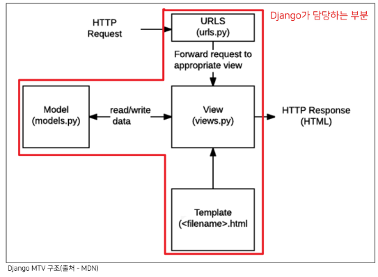
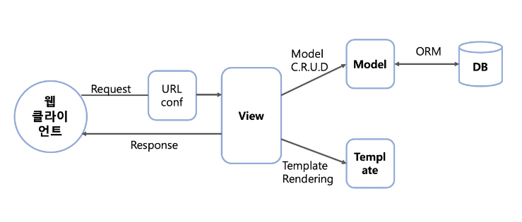
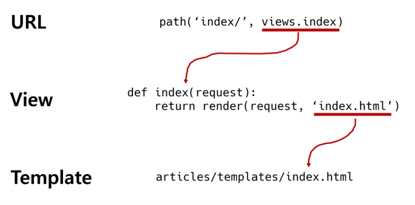
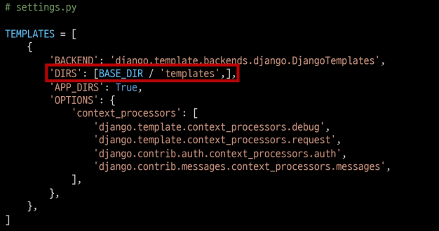
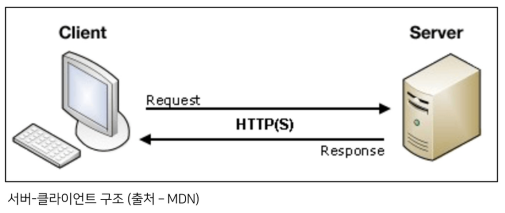

# Django

### Framework

서비스 개발에 필요한 기능들을 미리 구현해서 모아놓은 것. 

- 프레임 워크를 활용하면 웹 서비스 개발에 있어서 모든 것들을 직접 개발할 필요 없이, 만들고자 하는 본질에 집중하여 개발 가능
- 대규모 프로젝트에서 개발 일관성 향상, 유지보수 용이
- 소프트웨어의 생산성과 품질을 높일 수 있음
    - Library란?
        
        라이브러리는 단순 활용 가능한 도구들의 집합을 의미
        
        개발자가 만든 클래스에서 호출해 사용하며, 클래스들의 나열로 필요한 클래스를 불러서 사용하는 방식을 취함
        

### Library vs Framework

- 라이브러리와 프레임워크의 차이는 제어 흐름에 대한 주도성이 어디에 있는가에 달려있음
- 프레임워크에는 분명한 **제어의 역전** 개념이 적용
    - 제어의 역전
        
        어떤 일을 하도록 만들어진 프레임워크에 제어의 권한을 넘김으로써 클라이언트(개발자)가 신경 써야 할 것을 줄이는 전략.
        
        프레임워크의 event, delegate에 클라이언트의 메소드를 등록⇒ 호출
        
- 프레임워크는 전체적인 흐름을 스스로 쥐고 있으며, 사용자(개발자)는 그 안에서 필요한 코드를 짜 넣는 반면, 라이브러리는 사용자(개발자)가 전체적인 흐름을 만들며 라이브러리를 가져다 쓰는 것
    - 동작하는 중에 필요한 기능이 있을 때 메소드를 능동적으로 사용 ⇒ 라이브러리
    - 미리 만들어진 메소드가 클라이언트 코드를 호출하는 것 ⇒ 프레임워크
- 쉬운 예시
    - 망치, 톱, 삽 = 라이브러리
    - 자동차, 비행기, 배 = 프레임워크

### Django

- Python으로 작성된 프레임워크
    - 파이썬이라는 언어의 강력함과 거대한 커뮤니티
- 수많은 여러 유용한 기능
    - 보안, 관리자 기능 등
- 검증된 웹 프레임워크
    - 화해, Toss, 두나무, 당근마켓, 요기요 등 많은 서비스들이 사용
    

### Django의 설계 철학

- 표현과 로직(view)을 분리
    - 템플릿 시스템은 표현을 제어하는 도구이자 표현에 관련된 로직일 뿐, 
    이러한 기본 목표를 넘어서는 기능을 지원하지 말아야 함
- 중복을 배제
    - **DRY(Don’t Repeat Yourself) 원칙**
        - 소스 코드에서 동일한 코드를 반복하지 말자는 의미
        - 동일한 코드가 반복된다는 것은 잠재적인 버그의 위협을 증가시키고, 수정 유지보수가 어려워진다는 것을 의미

### MTV 소프트웨어 디자인 패턴

- MVC 패턴을 기반으로한 Django의 디자인 패턴  [MVC패턴 알아보기](https://www.notion.so/WEB-8cecde1a62d4440aba91daaf6f0ea90f)
    - Model : 데이터 관련
    - Template : 화면 관련 (MVC View 역할)
    - View : Model - Template 중간 처리 및 응답 반환 (MVC Controller 역할)
    
    
    
    
    

## Django 설치

### 가상환경 설정

```bash
$ python -m venv venv
$ source venv/Scripts/activate << 가상환경 활성화
```

### Django 설치

- 가상환경 설정 및 활성화 마친 뒤 설치 진행
- Django 4.0 릴리즈로 인해 3.2(LTS)버전 명시해서 설치
    
    ```bash
    $ pip install django==3.2.13
    ```
    
    - LTS
        - Long Term Support (장기 지원 버전)
        - 일반적인 경우보다 장기간에 걸쳐 지원하도록 고안된 소프트웨어의 버전
        - 컴퓨터 소프트웨어의 제품 수명주기 관리 정책
        - 배포자는 LTS 확정을 통해 장기적이고 안정적인 지원을 보장

- 패키지 목록 생성
    
    ```bash
    $ pip freeze > requirements.txt
    ```
    
- 패키지 목록 설치
    
    ```python
    $ pip install -r requirements.txt
    ```
    

### 프로젝트 & 애플리케이션

### **Project**

- collection of apps
- 프로젝트는 앱의 집합
- 프로젝트에는 여러 앱이 포함될 수 있음
- 앱은 여러 프로젝트에 있을 수 있음

### **Application**

- 앱은 실제 요청을 처리하고 페이지를 보여주는 등의 역할을 담당
- 일반적으로 앱은 하나의 역할 및 기능 단위로 작성하는 것을 권장
- 프로젝트 생성
    
    ```bash
    $ django-admin startproject firstpjt .
    ```
    
    - 프로젝트 이름에는 Python이나 Django에서 사용 중인 키워드 및 ‘-’(하이픈) 사용 불가
    - ‘.’(dot)를 붙이지 않을 경우 현재 디렉토리에 프로젝트 디렉토리를 새로 생성하게 됨

- 서버 실행
    
    ```bash
    $ python manage.py runserver
    ```
    
    - manage.py가 있는 경로에서 실행
    - *종료는 `Ctrl + C`*
    
- 애플리케이션(앱) 생성
    
    ```bash
    $ python manage.py startapp articles
    ```
    
    - 일반적으로 애플리케이션 이름은 ‘복수형’으로 작성하는 것을 권장
    

## 요청과 응답

- URL → VIEW → TEMPLATE 순으로 요청이 이루어지고 역순으로 데이터가 반환됨
    
    
    

### `urls.py`

- 페이지 요청이 발생하면 가장 먼저 호출되는 파일로, URL과 VIEW 함수 간의 매핑을 정의함. (여기서 VIEW 함수는 `views.py` 파일에 정의된 함수를 지칭)
    
    ```python
    from django.contrib import admin
    from django.urls import path
    ***from myapps import views***
    
    **urlpatterns** = [
        path('admin/', admin.site.urls),
        path('myapps/', views.index),
    ]
    ```
    
- `myapps/` URL이 요청될 경우 `views.index`를 호출하라는 매핑을 **urlpatterns**에 추가
- 여기서 `views.index`는 views.py 파일의 index함수를 의미

### `views.py`

- HTTP 요청을 수신하고 HTTP 응답을 반환하는 함수 작성.
- Template에게 HTTP 응답 서식을 맡김
    
    ```python
    from django.http import HttpResponse
    
    def index(request):
        return HttpResponse("안녕하세요 pybo에 오신것을 환영합니다.")
    ```
    
    - **HttpResponse** *vs* **render** *vs* **redirect**
        
        [https://valuefactory.tistory.com/605](https://valuefactory.tistory.com/605)
        
- **render()**
    
    ```python
    from django.shortcuts import render
    
    def index(request):
        return render(request, template_name, context)
    ```
    
    - httpResponse 객체를 반환하는 함수로, 템플릿을 context와 엮어 httpResponse로 쉽게 반환하도록 하는 함수
    - request : 응답을 생성하는 데 사용되는 요청 객체 (필수)
    - template_name : 템플릿의 전체 이름 또는 템플릿 이름의 경로 (필수)
    - context : 템플릿에서 사용할 데이터(딕셔너리 타입으로 작성) (선택)
    

### `Templates`

- 실제 내용을 보여주는데 사용되며, 파일의 구조나 레이아웃을 정의
- Template 파일의 기본 경로이며, 템플릿 폴더 이름은 반드시 templates라는 이름으로 생성해야 함
- 어플리케이션 폴더 내에 templates 폴더 위치
`app_name/templates/`

### Django Template

- Django Template을 이용한 HTML 정적 부분과 동적 컨텐츠 삽입
- Template System의 기본 목표를 숙지
- **Django Template System**
    - 데이터 표현을 제어하는 도구이자 표현에 관련된 로직을 담당

### Django Template Language (DTL)

- Django Template에서 사용하는 built-in template system
- 조건, 반복, 변수 치환, 필터 등의 기능을 제공
    - Python처럼 일부 프로그래밍 구조(if, for 등)를 사용할 수 있지만, python 코드로 실행되는 것은 아님
    - Django 템플릿 시스템은 Python이 HTML에 포함된 것이 아니니 주의
- 프로그래밍적 로직이 아닌 프레젠테이션을 표현하기 위한 것임을 명심

### DTL Syntax

- **Variable**
    
    `{{ variable }}`
    
    - 변수명은 영어, 숫자와 밑줄(_) 조합으로 구성될 수 있으나, 밑줄로 시작하거나 공백, 구두점 문자는 사용 불가
    - dot(.)를 사용하여 변수 속성에 접근할 수 있음
    - render()의 세번째 인자로 {’key’: value}와 같이 딕셔너리 형태로 넘겨주며, 여기서 정의한 key에 해당하는 문자열이 template에서 사용 가능한 변수명이 됨
- **Filters**
    
    `{{ variable|filter }}`
    
    - 표시할 변수를 수정할 때 사용
    - 60여개의 built-in template filters를 제공
    - chained가 가능하며 일부 필터는 인자를 받기도 함
        
        ex) `{{ name|lower }}` : name 변수를 소문자로 출력
        
        `{{ name|truncatewords:30 }}` 
        
- **Tags**
    
    `{{ tag }}`
    
    - 출력 텍스트를 만들거나, 반복 또는 논리를 수행하여 제어 흐름을 만드는 등 변수보다 복잡한 일들을 수행
    - 일부 태그는 시작과 종료 태그가 필요 ex) ``
    - 약 24개의 built-in template tags 제공
- **Comments**
    
    `{# #}`
    
    - Django template에서 라인의 주석을 표현하기 위해 사용
    - 한줄 주석만 가능
    
    `` <내용> ``
    
    - 위와 같은 형태로 작성 시 여러 줄 주석 가능
    - <내용>란에 여러 줄 입력

## 템플릿 상속(Template inheritance)

- 코드의 재사용성을 높이고, 유지보수를 편하게 하기 위함
- 사이트의 모든 공통 요소를 포함하고, 하위 템플릿이 재정의(Override) 할 수 있는 블록을 정의하는 기본 skeleton 템플릿을 만들 수 있음

### ``

- 자식(하위) 템플릿이 부모 템플릿을 확장한다는 것을 알림
- 반드시 템플릿 최상단에 작성되어야 함 (2개 이상 사용 불가)

### ``

- 하위 템플릿에서 재지정(overridden)할 수 있는 블록을 정의
- 즉, 하위 템플릿이 채울 수 있는 공간
- 가독성을 높이기 위해 선택적으로 endvlock 태그에 이름을 지정할 수 있음
    
    ```html
    <!-- articles/templates/base.html -->
    <!DOCTYPE html>
    <html lang="en">
    <head>
        <meta charset="UTF-8">
        <meta http-equiv="X-UA-Compatible" content="IE=edge">
        <meta name="viewport" content="width=device-width, initial-scale=1.0">
        <title>Document</title>
    </head>
    <body>
        <h1>Django</h1>
        
        
    </body>
    </html>
    ```
    
    ```html
    <!-- index.html -->
    
    
        <h1>템플릿입니다</h1>
        <p>예시 1</p>
    
    ```
    
    <aside>
    ❓ *base.html의 위치를 앱 안의 template 디렉토리가 아닌,
    ****프로젝트 최상단의 templates 디렉토리에 위치시키고 싶다면?*
    
    기본 template 경로가 아닌 다른 경로를 추가하기 위해 다음과 같이 코드 작성
    
    
    
    - **BASE_DIR**  : `settings.py`에서 특정 경로를 절대 경로로 편하게 작성할 수 있도록 Django에서 미리 지정해둔 경로 값
    
    </aside>
    

## 데이터 전송 및 수신

- **Client & Server architecture**
    
    
    
- 웹은 다음과 같이 가장 기본적으로 클라이언트-서버 아키텍처를 사용
    - 클라이언트(일반적으로 웹브라우저)가 서버에 요청을 보내고, 서버는 클라이언트의 요청에 응답
- 클라이언트는 HTML form을 통해 서버에 HTTP요청을 보낼 수 있음

### HTML <form> element

- 웹에서 사용자 정보를 입력하는 여러가지의 방식을 제공(text, button, submit 등)
- 사용자로부터 할당된 데이터를 서버로 전송하는 역할을 담당
- 속성
    - **action** : 입력 데이터가 전송될 URL을 지정
    (속성을 지정하지 않을 경우 현재 form이 있는 페이지의 URL로 전송)
    - **method** : 데이터를 어떻게 보낼 것인지 입력 데이터의 HTTP request methods를 정의
    (GET, POST 2가지 방식 제공)
    

### HTML <input> element

- 사용자로부터 데이터를 입력 받기 위해 사용
- type 속성에 따라 동작 방식이 상이
- 핵심 속성
    - **name**
        - form을 통해 데이터를 제출(submit)했을 때 name 속성에 설정된 값을 서버로 전송하고, 서버는 name 속성에 설정된 값을 통해 사용자가 입력한 데이터 값에 접근
        - 주요 용도는 GET/POST 방식으로 서버에 전달하는 파라미터(name은 key, value는 value)로 매핑
    
    ```html
    <!-- articles/templates/throw.html -->
    
    
    
        <h1>Throw</h1>
        <form action="/catch/" method="#">
             <label for="message">Throw</label>
             <input type="text" name="message" id="message">
             <input type="submit">
        </form>
    
    ```
    

### HTTP request methods

- HTTP
    - HTML 문서와 같은 리소스(데이터, 자원)들을 가져올 수 있도록 해주는 프로토콜(규약)
- 웹에서 이루어지는 모든 데이터 교환의 기초
- HTTP는 주어진 리소스가 수행 할 원하는 작업을 나타내는 request methods를 정의
- HTTP Method : GET,POST, PUT, DELETE

### GET

- 서버로부터 정보를 조회하는데 사용
- 데이터를 가져올 때만 사용해야 함
- 데이터를 서버로 전송할 때 Query String Parameters를 통해 전송
- 데이터는 URL에 포함되어 서버로 보내짐

### Query String Parameters

- 사용자가 입력 데이터를 전달하는 방법 중 하나로, URL 주소에 데이터를 파라미터를 통해 넘기는 것
- 이러한 문자열은 앰퍼샌드(&)로 연결된 key=value 쌍으로 구성되며 기본 URL과 물음표(?)로 구분됨

### Trailing Slashes

- Django는 URL 끝에 ‘/’가 없다면 자동으로 붙여주는 것이 기본 설정
- 기술적인 측면에서 [foo.com/bar](http://foo.com/bar)와 [foo.com/bar/는](http://foo.com/bar/는) 서로 다른 URL임
- Django는 URL 정규화를 통해 복수의 페이지에서 같은 콘텐츠가 존재하는 것을 방지
- URL 정규화는 검색엔진 최적화에도 도움됨

### Variable routing

- URL 주소를 변수로 사용하는 것을 의미
- URL의 일부를 변수로 지정하여 view함수의 인자로 넘길 수 있음
- 변수는 ‘<>’에 정의
    
    ```python
    # urls.py
    urlpatterns = [
    		...
    		path('hello/<name>/'. views.hello)
    ]
    ```
    

### App URL mapping

- 각 앱의 view 함수를 다른 이름으로 import 할 수 있음
- 하나의 프로젝트에 여러 앱이 존재할 경우, 각각의 앱 안에 urls.py를 만들고 프로젝트 urls.py에서 각 앱의 urls.py로 URL 매핑을 위탁할 수 있음
- urlpattern은 언제든지 다른 URLconf모듈을 포함(include)할 수 있음
- include되는 앱의 urls.py에 `urlpatterns`가 작성되어 있지 않다면 에러 발생

### **include()**

- 다른 URLconf(app1/urls.py)들을 참조할 수 있도록 돕는 함수
- 함수 include()를 만나게 되면 URL의 그 시점까지 일치하는 부분을 잘라내고, 남은 문자열 부분을 후속 처리하기 위해 include된 URLconf로 전달

### URL patterns

- 링크에 URL을 직접 작성하는 것이 아닌, path() 함수의 name인자를 정의해서 사용
- DTL의 Tag 중 하나인 URL 태그를 사용하여 view 함수와 템플릿에서 특정 주소를 쉽게 참조 가능
``
- 주어진 URL 패턴 이름 및 선택적 매개 변수와 일치하는 절대 경로 주소를 반환

```python
urlpatterns = [
    path('index/', views.index, name='index'),
    path('pages/', views.pages, name='pages'),
]
```

```html
<form action="" method="GET">
    <label for="message">Order</label>
    <input type="text" name="message" id="message">
    <input type="submit">
</form>
```

### URL namespace

- 프로젝트의 규모가 커지고 앱이 많아짐에 따라 URL 이름이 중복되어 클릭시 원하는 페이지로 이동하지 않는 경우 발생
- URL namespace(이름 공간)를 사용하면 서로 다른 앱에서 동일한 URL 이름을 사용하는 경우에도 이름이 지정된 URL을 고유하게 사용할 수 있음  ``
- 단 app_name을 지정한 이후에는 url 태그에서 app_name:url_name 형태로만 사용해야 함
    
    ```python
    app_name = 'articles'
    urlpatterns = [
        path('index/', views.index, name='index'),
    ]
    ```
    
    ```python
    	<form action="" method="GET">
       ...
    ```
    

### Template namespace

- Django는 중복된 이름의 템플릿 파일이 존재하는 경우 templates의 기본 경로가 app_name/templates로 고정되어 있어, settings.py의 INSTALLED_APPS에 작성된 app 순서로 template를 검색 후 렌더링 하게 됨
- templates 폴더 내부에 디렉토리를 생성하여 물리적인 이름공간을 구분하면 문제를 해결할 수 있음
`app_name/templates/app_name`
    
    ```
    articles/
    		templates/
    				articles/
    						index.html
    						...
    pages/
    		templates/
    				pages/
    						index.html  | 파일 이름이 중복되어도 디렉토리를 통해 구분되어 문제발생 X
    						...
    ```
    