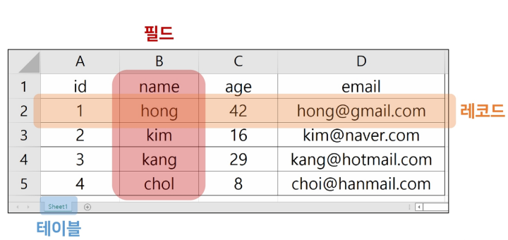
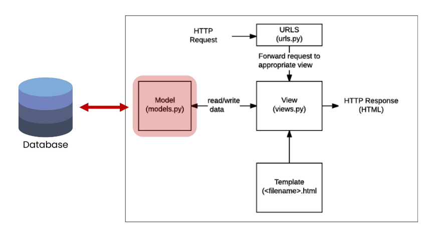

# [Django] Model

### Database

검색 및 구조화 같은 작업을 보다 쉽게 하기위해 조직화된 데이터를 수집하는 저장 시스템

- **기본 구조**
    - **스키마(Schema)**
        - 뼈대
        - 데이터베이스에서 자료의 구조, 표현 방법, 관계 등을 정의한 구조
    - **테이블(Table)**
        - 필드와 레코드를 사용해 조직된 데이터 요소들의 집합
        - 관계(Relation)라고도 부름



- **용어 설명**
    - **필드(Field)** : 속성, 컬럼(Column)
    - **레코드(Record)** : 튜플, 행(Row)
    - **PK(Primary Key)** : 기본 키. 각 레코드의 고유한 값(식별자). 다른 항목과 중복되지 않는 단일 값(unique)을 가짐 (ex. id, 주민등록번호)
    - **쿼리(Query)** : 데이터를 조회하거나 추출, 조작하는 명령어를 일컬음
    

### Model

- Django는 Model을 통해 데이터에 접속하고 관리
- 사용자가 저장하는 데이터들의 필수적인 필드들과 동작들을 포함하고 있음
- 일반적으로 각각의 모델은 하나의 데이터베이스 테이블에 매핑
(mapping : 하나의 값을 다른 값으로 대응시키는 것)
    - 모델 클래스 1개 == 데이터베이스 테이블 1개
    
    
    

### Field Type

- CharField : 제한된 문자열 필드 타입. max_length를 지정해야 함
- TextField : 대용량 문자열을 갖는 필드 타입
- IntegerField : 32비트 정수형 필드 타입. 정수 사이즈에 따라 BigIntegerField, SmallIntegerField를 사용할 수도 있음
- BooleanField : True/False 필드 타입. NULL을 허용하기 위해서는 NullBooleanField를 사용
- DateTimeField : 날짜와 시간을 갖는 필드 타입. 날짜만 가질 경우 DateField, 시간만 가질 경우 TimeField를 사용할 수도 있음
- DecimalField : 소수점을 갖는 decimal 필드 타입
- BinaryField : binary 데이터(2진수)를 저장하는 필드 타입
- FileField : 파일 업로드 필드 타입
- ImageField : FIleField의 파생 클래스로, 이미지 파일 여부를 체크
- UUIDField : GUID(UUID)를 저장하는 필드 타입

### Field options

- **null** (DB 옵션) : DB Field에 NULL 허용 여부 (default : False)
- **unique** (DB 옵션) : 유일성 여부 (default : False)
- **blank** : 입력값 유효성 (validation) 검사 시 empty 값 허용 여부 (default : False)
- **primary_key** : 해당 필드가 Primary Key임을 표시 (primary_key = True)
- **default** : 필드의 디폴트 값을 지정
- **verbose_name** : Field label이 지정되지 않으면 필드명이 쓰여짐
- **validators** : 입력값 유효성 검사를 수항할 함수를 다수 지정
각 필드마다 공유한 validators들이 이미 등록되어 있기도 함
ex) 이메일 형식, 길이 제한 등
- **choices** (form widget용) : select box 소스로 사용
- **help_text** (form widget용) : 필드 입력 도움말 지정
- **auto_now** : True 인 경우, record 수정 시마다 현재 시간을 자동 저장
- **auto_now_add** : True 인 경우, record 생성 시 현재 시간으로 자동 저장(최초 저장시에만 적용)

```python
models.IntegerField(null = True)
models.IntegerField(unique = True)
models.DateTimeField(blank = True)
models.CharField(max_length = 10, primary_key = True)
models.CharField(max_length=5, default="ssafy")
```

### Migrations

- 모델에 대한 청사진(blueprint)을 만들고, 이를 통해 테이블을 생성하는 일련의 과정
- Django가 모델에 생긴 변화(필드 추가, 모델 삭제 등)를 DB에 반영하는 방법
- **주요 명령어**
    - **makemigrations**
        - 모델을 작성 혹은 변경한 것에 기반한 새로운 설계도를 만들 때 사용.
        - 테이블을 만들기 위한 설계도를 생성하는 것
        - 명령어 실행 후 migrations/0001_initial.py가 생성
            
            ```bash
            $ python manage.py makemigrations
            ```
            
    
    - **migrate**
        - `makemigrations`로 만든 설계도를 실제 db.sqlite3 DB파일에 반영
        - 결과적으로 모델에서의 변경사항들과 DB의 스키마가 동기화를 이룸
            
            ```bash
            $ python manage.py migrate
            ```
            
    
    - **showmigrations**
        - migrations 파일들이 정상적으로 migrate 됐는지 여부를 확인하는 용도로 사용
        - [x] 표시가 된 경우 migrate 완료되었음을 의미
            
            ```bash
            $ python manage.py showmigrations
            ```
            
    
    - **sqlmigrate**
        - 해당 migrations 파일이 SQL 문으로 어떻게 해석될 지 미리 확인할 수 있음
            
            ```bash
            $ python manage.py sqlmigrate articles 0001
            ```
            

### DB 초기화

1. **migrations 파일 삭제**
    1. migrations 폴더 및 \_\_init\_\_.py 는 삭제하지 않음
    2. 번호가 붙은 파일만 삭제
2. **db.sqlite3 삭제**
3. **migrations 진행**
    1. makemigrations
    2. migrate
    

### HTTP

- Hyper Text Transfer Protocol
- HTML 문서와 같은 리소스들을 가져올 수 있도록 해주는 프로토콜(규칙, 규약)
- WEB(WWW)에서 이루어지는 모든 데이터 교환의 기초
- 클라이언트 - 서버 프로토콜이라고도 부름

### 요청과 응답

- **요청(requests)**
    - 클라이언트(웹브라우저)에 의해 전송되는 메시지
- **응답(response)**
    - 서버에서 응답으로 전송되는 메시지

### HTTP 특징

- **비 연결 지향(connectionless)**
    - 서버는 요청에 대한 응답을 보낸 후 연결을 끊음
        - 예를 들어 우리가 네이버 메인 페이지를 보고 있을 때 우리는 네이버 서버와 연결 되어 있는 것이 아님
        - 네이버 서버는 우리에게 메인 페이지를 응답하고 연결을 끊음
- **무상태(stateless)**
    - 연결을 끊는 순간 클라이언트와 서버 간의 통신이 끝나며 상태 정보가 유지되지 않음
    - 클라이언트와 서버가 주고받는 메시지들은 서로 완전히 독립적
    

### 쿠키와 세션

- 서버와 클라이언트 간 지속적인 상태 유지를 위해 존재

### 쿠키(Cookie)

- HTTP 쿠키는 상태가 있는 세션을 만들도록 해 줌
- 서버가 사용자의 웹 브라우저에 전송하는 작은 데이터 조각
- 사용자가 웹사이트를 방문할 경우 해당 웹사이트의 서버를 통해 사용자의 컴퓨터에 설치되는 작은 기록 정보 파일
    - 브라우저(클라이언트)는 쿠키를 로컬에 KEY-VALUE의 데이터 형식으로 저장
    - 동일한 서버에 재요청 시 저장된 쿠키를 함께 전송
- 쿠키는 두 요청이 동일한 브라우저에서 들어 왔는지 여부를 판단할 때 주로 사용
    - 이를 이용하여 사용자의 로그인 상태를 유지할 수 있음 (매 요청마다 쿠키를 함께 전송)
    - 상태가 없는(stateless) HTTP 프로토콜에서 상태 정보를 기억시켜 주기 때문
- 즉, 웹 페이지에 접속하면 웹 페이지를 응답한 서버로부터 쿠키를 받아 브라우저에 저장하고, 클라이언트가 같은 서버에 재요청 시마다 요청과 함께 저장해 두었던 쿠키도 함께 전송

### 쿠키 사용 목적

- 세션 관리(Session Management)
    - 로그인, 아이디 자동완성, 공지 하루 안보기, 팝업 체크, 장바구니 등의 정보 관리
- 개인화(Personalization)
    - 사용자 선호, 테마 등의 설정
- 트래킹(Tracking)
    - 사용자 행동을 기록 및 분석
    - 사용자 맞춤 광고 등에도 활용
    

### 세션 (Session)

- 사이트와 특정 브라우저 사이의 상태를 유지시키는 것
- 클라이언트가 서버에 접속하면 서버가 특정 session id를 발급하고, 클라이언트는 session id를 쿠키에 저장
    - 클라이언트가 다시 동일한 서버에 접속하면 요청과 함께 쿠키를 서버에 전달
    - 쿠키는 요청 때마다 서버에 함게 전송되므로 서버에서 session id를 확인해 알맞은 로직을 처리
- session id는 세션을 구별하기 위해 필요하며 쿠키에는 session id만 저장

### 쿠키의 수명(Lifetime)

- Session Cookie
    - 현재 세션(current session)이 종료되면 삭제됨
    - 브라우저 종료와 함께 세션이 삭제됨
- Persistent Cookies
    - Expires 속성에 지정된 날짜 혹은 Max-Age 속성에 지정된 기간이 자나면 삭제됨