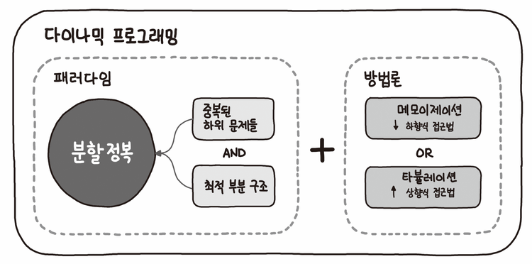

# 동적계획법(DP)

## 동적 계획법(DP, Dynamic Programming)

- 입력 크기가 작은 부분을 모두 해결한 후, 그 해들을 이용하여 보다 큰 크기의 무제들을 해결, 최종적으로 주어진 입력의 문제를 해결하는 알고리즘.
- 그리디 알고리즘과 같이 최적화 문제를 해결하는 알고리즘



파이썬 알고리즘 인터뷰(책만 출판사)

### DP의 구현 방식

- recursive 방식 : fibo()
- iterative 방식 : fibo()
- memoization을 재귀적 구조에 사용하는 것보다 반복적 구조로 DP를 구현한 것이 성능 면에서 효율적

### 피보나치 수 재귀 이용 [O(2^n)]

```python
def fibonacci(n):
		if n <= 1:
				return n
		return fibonacci(n-1) + fibonacci(n-2)
```

### 피보나치 수 DP 이용 [O(n)]

- 피보나치 수는 부분 문제의 답으로부터 본 문제의 답을 얻을 수 있으므로, 최적 부분 구조로 이루어짐.

```python
def fibonacci(n):
		f = [0, 1]

		for i in range(2, n+1):
				f.append(f[i-1] + f[i-2])

		return f[n]
```