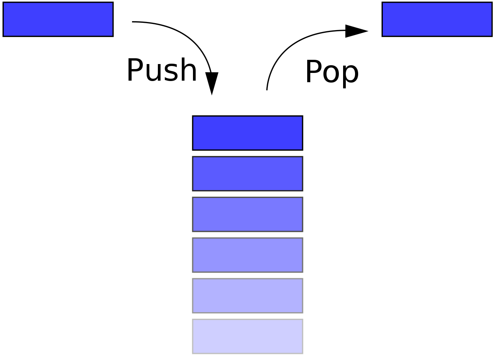

# 스택(Stack)



위키백과

- 물건을 쌓아 올리듯 자료를 쌓아 올린 후입선출(LIFO, Last-In-First-Out)형태의 자료구조
    - FIFO(선입선출) : 먼저 삽입한 자료를 먼저 꺼내는 방식(ex. Stack)
        - LIFO(후입선출) : 가장 나중에 꺼낸 자료부터 꺼내는 방식(ex. Queue)
- 스택에 저장된 자료는 선형 구조를 가짐
    - 선형 구조 : 자료 간의 관계가 1:1의 관계
    - 비선형 구조 : 자료 간의 관계가 1:N의 관계 (Ex. 트리)

### 스택의 구현

](./img/115.png)

[https://images.app.goo.gl/aei6cALjvUhK2WN86](https://images.app.goo.gl/aei6cALjvUhK2WN86)

- 자료 구조 : 자료를 선형으로 저장할 저장소
    - 배열 사용
    - 저장소 자체를 스택이라 부름
    - 스택에서 마지막 삽입된 원소의 위치를 top이라 함
- 일반적으로 스택에서 사용되는 연산
    - push : 저장소에 자료 저장
    - pop : 저장소에 삽입한 자료의 역순(마지막 삽입한 자료부터)으로 원소를 반환하고 스택에서 삭제
    
    ](./img/116.png)
    
    [https://somjang.tistory.com/entry/파이썬으로-구현하는-자료구조-스택-Stack](https://somjang.tistory.com/entry/%ED%8C%8C%EC%9D%B4%EC%8D%AC%EC%9C%BC%EB%A1%9C-%EA%B5%AC%ED%98%84%ED%95%98%EB%8A%94-%EC%9E%90%EB%A3%8C%EA%B5%AC%EC%A1%B0-%EC%8A%A4%ED%83%9D-Stack)
    
    - isEmpty : 스택이 공백인지 아닌지를 확인하는 연산
    
    ](./img/117.png)
    
    [https://somjang.tistory.com/entry/파이썬으로-구현하는-자료구조-스택-Stack](https://somjang.tistory.com/entry/%ED%8C%8C%EC%9D%B4%EC%8D%AC%EC%9C%BC%EB%A1%9C-%EA%B5%AC%ED%98%84%ED%95%98%EB%8A%94-%EC%9E%90%EB%A3%8C%EA%B5%AC%EC%A1%B0-%EC%8A%A4%ED%83%9D-Stack)
    
    - peek(또는 top) : 가장 마지막에 삽입한 데이터를 삭제하지 않고 return (↔pop과 차이)
    
    ](./img/118.png)
    
    [https://somjang.tistory.com/entry/파이썬으로-구현하는-자료구조-스택-Stack](https://somjang.tistory.com/entry/%ED%8C%8C%EC%9D%B4%EC%8D%AC%EC%9C%BC%EB%A1%9C-%EA%B5%AC%ED%98%84%ED%95%98%EB%8A%94-%EC%9E%90%EB%A3%8C%EA%B5%AC%EC%A1%B0-%EC%8A%A4%ED%83%9D-Stack)
    

### Stack Overflow

- 프로그램 호출 stack에서 이용 가능한 공간 이상을 사용하는 경우, stack overflow가 발생

### 스택의 구현

```python
class Stack():
    def __init__(self):
        self.stack = []

    def push(self, data):
        self.stack.append(data)
    
    def pop(self):
        if self.isEmpty():
            print("stack is empty")
        else:
            return self.stack.pop()
    
    def peek(self):
        if self.isEmpty():
            print('stack is empty')
        else:
            self.stack[-1]
        
    def isEmpty(self):
        if len(self.stack) == 0:
            return True
        else:
            return False
```

### 스택의 활용

- 괄호 검사