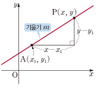
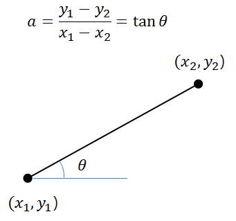

# 2022.09.04(일타싸피)

## 직선의 방정식

- **기울기**
    
    
    
    - 직선 $y=mx+n$에서 기울기 $m$은
    
    $$
    m = {(y의 증가량)\over (x의 증가량)}
    $$
    
    - 특히, $y=mx+n$이 $x$축의 양의 방향과 이루는 각을 $\theta$라고 한다면
    $**m = tan\theta**$

- $x$**절편과 $y$절편**
    - $x$절편 : 직선이 $x$축과 만나는 점의 $x$좌표
    - $y$절편 : 직선이 $y$축과 만나는 점의 $y$좌표

## 원의 방정식

- 원의 중심이 (a, b)이고, 반지름의 길이가 r인 원의 방정식

- 원의 방정식의 표준형

$$
(x-a)^2 + (y-b)^2 = r^2
$$

[https://img1.daumcdn.net/thumb/R1280x0/?scode=mtistory2&fname=http%3A%2F%2Fcfile7.uf.tistory.com%2Fimage%2F271EB63B521D8762207778](https://img1.daumcdn.net/thumb/R1280x0/?scode=mtistory2&fname=http%3A%2F%2Fcfile7.uf.tistory.com%2Fimage%2F271EB63B521D8762207778)

## 점과 직선사이의 거리

## math 모듈

- `math.sin(x)` : $x$ radian의 사인을 반환
- `math.cos(x)` : $x$ radian의 코사인을 반환
- `math.tan(x)` : $x$ radian의 탄젠트를 반환
- `math.atan(x)` : $x$의 아크탄젠트를 radian으로 반환
- `math.degrees(x)` **:** radian → degree 변환
- `math.radians(x)` : degree → radian 변환