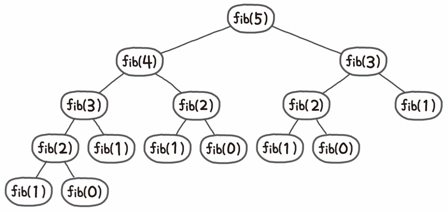
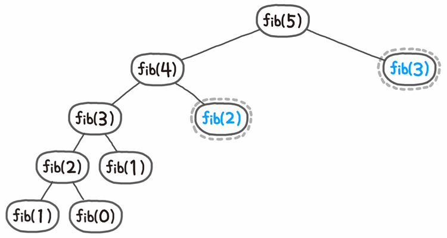

# 재귀(Recursion)

- 함수가 자기 자신을 호출하는 형태로 반복이 이루어지는 함수

```python
n=int(input())

def abc(level):
    if level == n:
        print(f'level: {level}')
        return
    abc(level+1)
    print(f'level: {level}')
abc(0)
```

```python
def recursive(num):
    print(num, end=' ')
    if num==5:
        return
    recursive(num+1)
    print(num, end=' ')
recursive(1)
# 1 2 3 4 5 4 3 2 1
```

```python
cnt=0
def recursive(num):
    global cnt
    cnt+=1
    if cnt>3:
        print(num, end=' ')
        return
    recursive(num+2)
    print(num, end=' ')
n=int(input()) # 1 입력
recursive(n)
# 7 5 3 1
```

### 최대 재귀 한도 깊이(Maximum Recursion Depth)

재귀적 구조는 내부에 시스템 호출 스택을 사용하는 오버헤드가 발생하기 때문에, 파이썬은 오버플로우로부터 보호하기 위해 스택, 힙, 정적 메모리 제한을 정해두고 있음.

대략 재귀 깊이 1000정도가 재귀한도로 설정됨.

### 재귀를 이용해 누적합 구하기

```python
# 1. 전역변수 이용
arr = [3,4,5,1,6,9]
total = 0
def recursive(num):
    global total
    if num == len(arr):
        return total
    total += arr[num]
    recursive(num+1)
recursive(0)
print(total) # 28

# 2. 매개변수 이용
arr = [3,4,5,1,6,9]
def recursive(num, total):
    if num == len(arr):
        return
    total += arr[num]
    recursive(num+1, total)
    print(total) # 28 19 13 12 7 3
recursive(0, 0) 
```

### 주사위

- **중복순열**

```python
dice = [1,2,3,4,5,6]
path = []
def throw(level):
    if level == 4:
        print(path)
        return
    for i in range(6):
        path.append(dice[i])
        throw(level+1)
        del path[level]
throw(0)
```

- **순열**

```python
dice = [1,2,3,4,5,6]
used = [0]*6 # 사용했던 숫자를 기록
path = []
def abc(level):
    if level == 3:
        print(path)
        return
    for i in range(6):
        if used[i]==1: continue
        path.append(dice[i])
        used[i]=1
        abc(level+1)
        del path[level]
        used[i]=0
abc(0)
```

- **조합**

```python
# 방법 1. 문자열 비교를 통한 조합 구현
arr = ['A', 'B', 'C', 'D']
path = ['']*3

def abc(level):
    if level == 3: #깊이가 3이 되면 프린트 후 리턴
        print(path)
        return

    for i in range(4):
        if level>0 and path[level-1]>=arr[i]: # 문자열 비교
				# 깊이가 1 이상, level-1의 패스가 지금 들어갈 값보다 크거나 같은 경우
						continue 
        path[level]=arr[i]
        abc(level+1)
        path[level]='' # <= 이 부분은 다른 값으로 덮어 씌워지기 때문에 생략 가능
abc(0)
```

```python
# 방법 2. start 매개변수를 이용한 조합 구현
arr = ['A', 'B', 'C', 'D']
path = ['']*3

def abc(level, start):
    if level == 3: #깊이가 3이 되면 프린트 후 리턴
        print(path)
        return

    for i in range(start, 4):
        path[level]=arr[i]
        abc(level+1, i+1)
abc(0)
```

- 중복을 허용한 n개의 주사위 숫자 조합

```python
# n개의 주사위를 던져 나올 수 있는 모든 숫자를 모두 출력해주세요
n = int(input())
dice = [1,2,3,4,5,6]
path = ['']*n
def combine(level, start):
    if level == n:
        print(path)
        return
    for i in range(start, 6):
        path[level]=dice[i]
        combine(level+1, i)
combine(0, 0)
```

### 재귀를 이용한 피보나치 수열



파이썬 알고리즘 인터뷰(책만 출판사) (재귀를 이용한 피보나치 수열)

```python
def fibonacci(n):
		if n <= 1:
				return n
		return fibonacci(n-1) + fibonacci(n-2)
```

### 메모이제이션(Memoization)

- 재귀에서 이전에 계산된 결과를 리스트에 저장함으로써 연산을 줄여 실행속도를 빠르게 하는 기술. 동적 계획법의 핵심
- 피보나치의 경우 O(2^n) → O(n). 획기적으로 줄일 수 있음.



파이썬 알고리즘 인터뷰(책만 출판사)

```python
def fibonacci(n):
		if n >= 2 and len(memo) <= n:
				memo.append(fibonacci(n-1) + fibonacci(n-2))
		return memo[n]
memo = [0, 1] # 피보나치의 0과 1은 0,1로 초기화
```